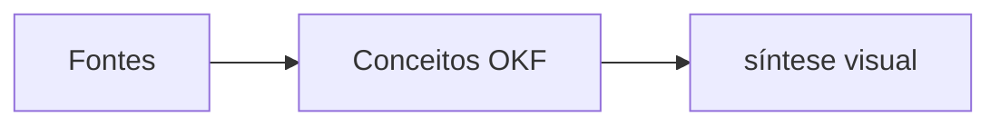

# Exemplo-ouro de síntese visual OKF

> [!abstract] TL;DR
> O formato visual melhora a leitura, enquanto o bundle OKF preserva metadados, citações e relações rastreaveis.

## Mecanismo

## Cola rápida

| Elemento | Funcao |
| --- | --- |
| Frontmatter | Permite consumo por agentes |
| Callouts | Ajudam a escanear a nota |
| citações | mantém a proveniência |

# Citations

[1] [Fonte de exemplo](/sources/exemplo.md)