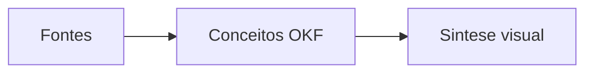

# Exemplo-ouro de sintese visual OKF

> [!abstract] TL;DR
> O formato visual melhora a leitura, enquanto o bundle OKF preserva metadados, citacoes e relacoes rastreaveis.

## Mecanismo

## Cola rapida

| Elemento | Funcao |
| --- | --- |
| Frontmatter | Permite consumo por agentes |
| Callouts | Ajudam a escanear a nota |
| Citacoes | Mantem a proveniencia |

# Citations

[1] [Fonte de exemplo](/sources/exemplo.md)