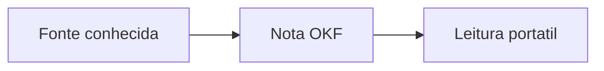
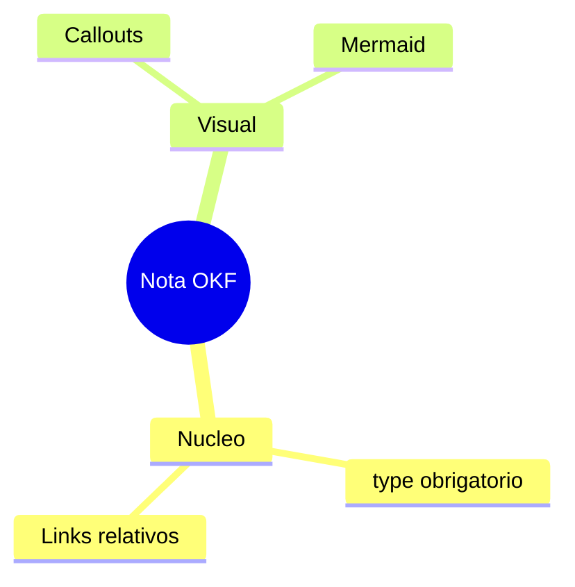

# Nota de pesquisa visual

> [!abstract] TL;DR
> Uma nota OKF preserva um nucleo persistido simples e usa recursos visuais apenas para facilitar a leitura.

> [!info] Proveniencia
> Gerada a partir do notebook conhecido como "Guia de pesquisa" em 2026-07-16.

## Mecanismo

| Pilar | Papel |
|---|---|
| **Nucleo OKF** | Garante frontmatter, `type`, H1 e links relativos. |
| **Extensoes visuais** | Melhoram leitura sem substituir o conteudo essencial. |

## Aplicacao

Leia a [nota relacionada](../referencias/nota-relacionada.md) quando ela existir no bundle. Nao use wikilinks.

## Mapa

## Cola rapida

| Verificar | Resultado esperado |
|---|---|
| `type` | Campo nao vazio no frontmatter |
| Links | Markdown relativo |
| Visual | Opcional e compreensivel fora do Obsidian |

> Nucleo OKF: UTF-8, frontmatter com `type`, H1, proveniencia e links relativos. Extensoes visuais: Mermaid e callouts.