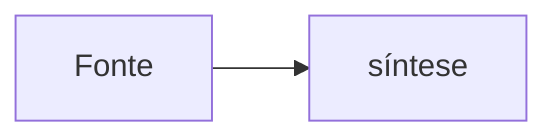

# síntese de teste

> [!abstract] TL;DR
> A síntese aponta para conceitos de fonte e preserva a proveniência.

Leia a [fonte](/sources/video.md).

```mermaid
flowchart LR
    A["Fonte"] --> B["síntese"]
```

# Citations

[1] [Fonte](/sources/video.md)